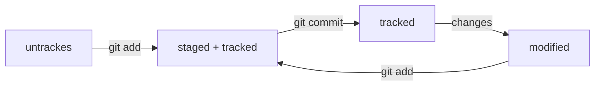

# Git-Helper

Это проект-помощник служит руководством для работы с Git, системой контроля версий. Он содержит основные команды, понятия и инструкции по инициализации проекта, работе с коммитами и регистрации на GitHub.

## Основные понятия

- **Репозиторий**: Хранилище для вашего проекта, которое содержит все файлы и историю изменений.
- **Коммит**: Снимок состояния вашего репозитория в определённый момент времени, сохраняющий изменения.
- **Ветка**: Независимая линия разработки в репозитории. Основная ветка обычно называется `main` или `master`.
- **Слияние (Merge)**: Процесс объединения изменений из одной ветки в другую.
- **Удалённый репозиторий**: Репозиторий, размещённый на сервере, например, на GitHub, GitLab или Bitbucket.

## Установка Git

1. **Windows**: Скачайте и установите [Git для Windows](https://git-scm.com/download/win).
2. **macOS**: Установите через Homebrew:

```bash
   brew install git
```

3. **Linux**: Установите через пакетный менеджер вашего дистрибутива:

```bash
   sudo apt-get install git  # для Ubuntu
   sudo dnf install git      # для Fedora
```


## Инициализация проекта

Для инициализации нового проекта выполните следующие шаги:

1. Создайте новую папку для вашего проекта и перейдите в неё:

```bash
   mkdir my-project
   cd my-project
```

2. Инициализируйте новый репозиторий:

```bash
   git init
```

**Теперь у вас есть пустой репозиторий Git, готовый к работе!**

## Работа с коммитами

1. **Добавьте файлы в репозиторий**:
   Для добавления всех файлов используйте:

```bash
   git add .
```

Или добавьте конкретный файл:

```bash
   git add filename.txt
```
   
2. **Создайте коммит**:
   После добавления файлов создайте коммит, описав изменения:

```bash
   git commit -m "Добавлено первое описание"
```

3. **Посмотрите историю коммитов**:
   Чтобы просмотреть историю изменений:

```bash
   git log
```

## Работа с ветками

1. **Создайте новую ветку**:

```bash
   git branch new-branch
```
   
2. **Переключитесь на новую ветку**:

```bash
   git checkout new-branch
```

3. **Объедините ветку с основной**:
   Перейдите на основную ветку и объедините изменения:

```bash
   git checkout main
   git merge new-branch
```

## Регистрация на GitHub

1. Перейдите на [GitHub](https://github.com/) и нажмите "Sign up".
2. Введите свою электронную почту, создайте пароль и введите ваше имя пользователя.
3. Следуйте инструкциям для подтверждения регистрации.

## Создание удалённого репозитория на GitHub

1. Войдите в свой аккаунт на GitHub.
2. Нажмите на кнопку "New" или "Create repository".
3. Введите имя репозитория и описание.
4. Выберите опции по умолчанию и нажмите "Create repository".

Теперь ваш удалённый репозиторий создан. Чтобы связать локальный репозиторий с удалённым, выполните следующие команды:

```bash
git remote add origin https://github.com/username/my-project.git
git branch -M main
git push -u origin main
```

## Полезные команды Git

- `git status`: Просмотреть статус файла в репозитории.
- `git clone <url>`: Клонировать удалённый репозиторий.
- `git pull`: Получить последние изменения из удалённого репозитория.
- `git push`: Отправить ваши коммиты на удалённый репозиторий.

# Хеш, лог и HEAD в commit

Три важных понятия, которые необходимо знать при работе с Git:

- **Хеш** - идентификатор коммита.
- **Лог** - список коммитов с их описанием.
- **HEAD** - последний сделанный коммит.

Команда `git log` выводит информацию о коммитах, включая строчки с набором букв и цифр. Информация о коммите — это набор данных: когда был сделан коммит, содержимое файлов в репозитории на момент коммита и ссылка на предыдущий, или родительский, коммит. Git хеширует (преобразует) эту информацию с помощью алгоритма SHA-1 и получает для каждого коммита свой уникальный хеш — результат хеширования.

Хеширование (от англ. hash, «рубить», «крошить», «мешанина») — это способ преобразовать набор данных и получить их «отпечаток». Информация относительно коротка (40 символов в случае SHA-1) и состоит из цифр 0 — 9 и латинских букв A — F (неважно, заглавных или строчных). Хеш обладает следующими важными свойствами:

- Если хеш получить дважды для одного и того же набора входных данных, то результат будет гарантированно одинаковый.
- Если хоть что-то в исходных данных поменяется (хотя бы один символ), то хеш тоже изменится (причём сильно).

Элементы, состоящие в описании лог

- **Строка из цифр и латинских букв** после слова `commit` — это уже знакомый вам хеш коммита.
- **Author** — имя автора и его электронная почта.
- **Date** — дата и время создания коммита.
- **Сообщение к коммиту.**

Если в репозитории уже много коммитов, необходимо вызвать сокращённый лог командой `git log` с флагом `--oneline`. При этом в терминале появятся только первые несколько символов хеша каждого коммита и комментарии к ним.

Сокращённый хеш (первые несколько символов полного) можно использовать точно так же, как и полный. Для этого команда `git log --oneline` автоматически подбирает такую длину сокращённых хешей, чтобы они были уникальными в пределах репозитория и Git всегда мог понять, о каком коммите идёт речь.

При вызове команды `git log` также присутствует надпись `(HEAD -> master)` после хеша одного из коммитов.

Файл `HEAD` (англ. «голова», «головной») — один из служебных файлов папки `.git`. Он указывает на коммит, который сделан последним (то есть на самый новый).

Если нужно передать последний коммит, то вместо его хеша можно просто написать слово `HEAD` — Git поймёт, что имелось в виду последний коммит.

## Статусы файлов

Командой `git status` можно проверять состояния (или статусы) файлов. Существует 4 статуса файлов:

1. **untracked** (англ. «неотслеживаемый»)
   Новые файлы в Git-репозитории помечаются как untracked, то есть неотслеживаемые. Git «видит», что такой файл существует, но не следит за изменениями в нём. У untracked-файла нет предыдущих версий, зафиксированных в коммитах или через команду `git add`.

2. **staged** (англ. «подготовленный»)
   После выполнения команды `git add` файл попадает в staging area (от англ. stage — «сцена», «этап [процесса]» и area — «область»), то есть в список файлов, которые войдут в коммит. В этот момент файл находится в состоянии staged.

3. **tracked** (англ. «отслеживаемый»)
   Состояние tracked — это противоположность untracked. Оно довольно широкое по смыслу: в него попадают файлы, которые уже были зафиксированы с помощью `git commit`, а также файлы, которые были добавлены в staging area командой `git add`. То есть все файлы, в которых Git так или иначе отслеживает изменения.

4. **modified** (англ. «изменённый»)
   Состояние modified значит, что Git сравнил содержимое файла с последней сохранённой версией и нашёл отличия. Например, файл был закоммичен и после этого изменён.

Вот что ещё важно учесть:
- Для файлов в состояниях staged и modified обычно не указывается, что они также tracked, потому что это состояние подразумевается.
- Команда `git add` добавляет в staging area только текущее содержимое файла.

### Типичный жизненный цикл файла в Git




1. Файл только что создали. Git ещё не отслеживает его содержимое. Состояние: **untracked**.
2. Файл добавили в staging area с помощью `git add`. Состояние: **staged (+ tracked)**.
   a. Возможно, изменили файл ещё раз. Состояния: **staged**, **modified (+ tracked)**.
   b. Ещё раз выполнили `git add`. Состояние: **staged (+ tracked)**.
3. Сделали коммит с помощью `git commit`. Состояние: **tracked**.
4. Изменили файл. Состояние: **modified (+ tracked)**.
5. Снова добавили в staging area с помощью `git add`. Состояния: **staged (+ tracked)**.
6. Сделали коммит. Состояния: **tracked**.
7. Повторили пункты 4 − 7 много-много раз.

# Рекомендации по оформлению сообщений к коммитам

Есть общие рекомендации по тому, как правильно составить сообщение к коммиту. Оно должно быть:
- Относительно коротким, чтобы его было легко прочитать (не более 72 символов);
- Информативным.

Существует много подходов к оформлению сообщений коммитов, но есть несколько популярных стилей, которые используют как отдельные команды, так и целые проекты.

## Корпоративный стиль

Во многих компаниях применяется Jira — система для организации проектов и задач. У каждой задачи в Jira есть идентификатор из нескольких заглавных латинских букв и номера. Например, `LGS-239` означает, что это 239-я задача в проекте LGS.

В корпоративном стиле в начале сообщения обычно указывают Jira-ID, а после — текст сообщения. Некоторые команды могут договариваться о том, с какой части речи начинать сообщение и какой длины оно должно быть, другие — нет. Однако требование о наличии Jira-ID обычно строгое: оно позволяет автоматически связывать коммиты с задачами и проектами.

## Conventional Commits

Стандарт **Conventional Commits** отличается качественной документацией и подробной проработкой. Он подходит для репозиториев с исходным кодом программ. Использовать его для других типов проектов было бы неудобно.

**Conventional Commits** предлагает такой формат коммита: `<type>: <сообщение>`. Первая часть `type` — это тип изменений. Таких типов достаточно много. Вот два примера:
- `feat` (сокращение от англ. feature) — для новой функциональности;
- `fix` (от англ. «исправить», «устранить») — для исправленных ошибок.

## GitHub-стиль

GitHub можно использовать не только для хранения файлов проекта, но и для ведения списка задач этого проекта. Если коммит «закрывает» или «решает» какую-то задачу, то в его сообщении удобно указывать ссылку на неё. Для этого в любом месте сообщения нужно указать `#<номер задачи>`. В таком случае GitHub свяжет коммит и задачу.

Для сообщений на русском языке часто рекомендуют использовать инфинитивы. Например:
- Добавить тесты для PipkaService
- Исправить ошибку #123

Для сообщений на английском рекомендуется использовать повелительное наклонение. Например:
- Use library mega_lib_300
- Fix exit button

Эти рекомендации сложились исторически, и им следуют многие проекты.

## Заключение

Git — это мощная система контроля версий, которая помогает организовать и отслеживать изменения в ваших проектах. Надеемся, что данный помощник будет полезен для вас при работе с Git!

Для получения дополнительной информации и ресурсов, пожалуйста, посетите [официальную документацию Git](https://git-scm.com/doc).

